# Steam Library Explorer (SteamLE) - Aplicación Web con Vue.js

**Demo en vivo:** [steamle.vercel.app](https://steamle.vercel.app)

## Portada

**Nombre del Proyecto:** Steam Library Explorer (SteamLE)  
**Curso:** Desarrollo de Aplicaciones Web y Sistemas Operativos  
**Fecha:** Diciembre 2025

### Integrantes del Grupo
- Juan José Arévalo Gaona - 192389

---

## Introducción

Este proyecto consiste en una **Single Page Application (SPA)** desarrollada con **Vue.js 3** y **Bootstrap 5**, que simula una tienda de videojuegos inspirada en Steam. La aplicación permite a los usuarios registrarse, iniciar sesión, explorar un catálogo de juegos importados directamente desde la API de Steam, gestionar su biblioteca personal y realizar operaciones de administración.

La aplicación implementa autenticación de usuarios, rutas protegidas, operaciones CRUD completas para usuarios, productos y administradores, todo conectado a una **API REST personalizada basada en Google Sheets** como alternativa a MockAPI.

---

## Descripción Técnica

### Arquitectura del Proyecto

```
/src
├── /components          # Componentes reutilizables
│   ├── /administration  # Componentes del panel de administración
│   ├── /gameCards       # Tarjetas de juegos (producto, biblioteca)
│   ├── /loadingComponents # Pantallas de carga
│   ├── /modals          # Modales reutilizables
│   ├── /notifications   # Sistema de notificaciones Toast
│   └── /navs            # Navegación y tabs
├── /view                # Vistas principales
├── /router              # Configuración de Vue Router
├── /services            # Servicios para consumir APIs
├── /store               # Estado global (Pinia)
├── /assets              # Recursos estáticos y estilos
├── App.vue              # Componente raíz
└── main.js              # Punto de entrada
```

### API de Google Sheets (Sustituto de MockAPI)

En lugar de MockAPI, este proyecto utiliza una **API REST personalizada implementada con Google Apps Script** que permite operaciones CRUD sobre hojas de cálculo de Google Sheets.

#### Diferencias con MockAPI:

| Característica | MockAPI | Google Sheets API |
|---------------|---------|-------------------|
| Métodos HTTP | GET, POST, PUT, DELETE | Solo GET y POST |
| Enrutamiento | Directo por método | Roteado por parámetro `action` |
| Autenticación | API Key | Pública con ID de hoja |
| Hosting | Servicio externo | Google Apps Script |

#### Cómo funciona el enrutamiento de métodos

Dado que Google Apps Script solo soporta `GET` y `POST`, los demás métodos HTTP fueron **roteados** mediante un parámetro `action`:

```javascript
// Ejemplo de uso del servicio storageLE.js

// GET - Obtener todos los registros
await storageCredentials.getAll();

// POST con action=create - Crear nuevo registro
await storageCredentials.createData(nuevoUsuario);

// POST con action=update - Actualizar registro existente
await storageCredentials.updateData(index, usuarioActualizado);

// POST con action=delete - Eliminar registro
await storageCredentials.deleteData(index);
```

#### Estructura de la Clase StorageLE:

```javascript
class StorageLE {
    constructor(resourseName) {
        this.tabName = resourseName;  // Nombre de la pestaña (usuarios, productos, etc.)
        this.sheetId = "ID_DE_LA_HOJA";
    }
    
    async getAll() { /* GET request */ }
    async createData(data) { /* POST con action=create */ }
    async updateData(index, data) { /* POST con action=update */ }
    async deleteData(index) { /* POST con action=delete */ }
}
```

#### Recursos disponibles en la API:

| Recurso | Pestaña | Descripción |
|---------|---------|-------------|
| `credentials` | Usuarios | Datos de usuarios registrados |
| `products` | Productos | Catálogo de juegos (AppIDs) |
| `adminID` | Administradores | IDs de usuarios con privilegios |

---

## Flujo de Autenticación

### Inicio de Sesión (Login)

1. El usuario ingresa email y contraseña en el formulario de login
2. El sistema consulta el recurso `credentials` en Google Sheets
3. Se valida si el email y contraseña coinciden con algún registro
4. Si es válido, se guarda el usuario en **localStorage** como "token simulado"
5. Se redirige al usuario a la página principal

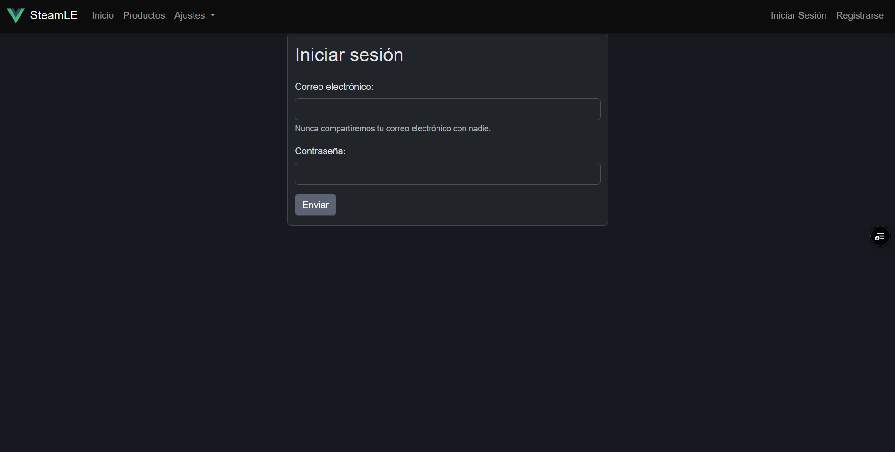

### Registro de Usuario

1. El usuario completa el formulario con nombre, email y contraseña
2. Se valida que el email no esté registrado
3. Se valida que las contraseñas coincidan
4. Se crea el nuevo usuario en Google Sheets
5. Se inicia sesión automáticamente

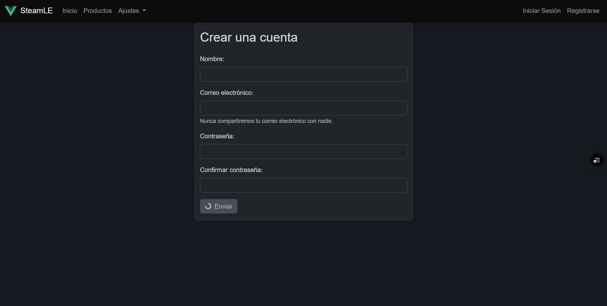

### Cierre de Sesión

- El botón de **Cerrar Sesión** en el Navbar elimina el usuario de localStorage
- Se redirige automáticamente a la página de login

---

## Protección de Rutas

La aplicación implementa **navigation guards** de Vue Router para proteger las rutas:

```javascript
router.beforeEach((to, from, next) => {
    const isAuthenticated = localStorage.getItem('user');
    
    if (to.meta.requiresAuth && !isAuthenticated) {
        next('/login');
    } else {
        next();
    }
});
```

### Rutas Protegidas:
- `/` - Página principal
- `/products` - Catálogo de productos
- `/game` - Detalles del juego
- `/library` - Biblioteca personal
- `/admin` - Panel de administración (requiere rol de administrador)

### Rutas Públicas:
- `/login` - Inicio de sesión
- `/registration` - Registro de usuario

---

## CRUD de Usuarios (Panel de Administración)

El panel de administración permite gestionar usuarios con operaciones CRUD completas.

### Listado de Usuarios

Muestra una tabla con todos los usuarios registrados, incluyendo:
- ID
- Nombre
- Email
- Cantidad de juegos en biblioteca
- Acciones (Editar, Eliminar)

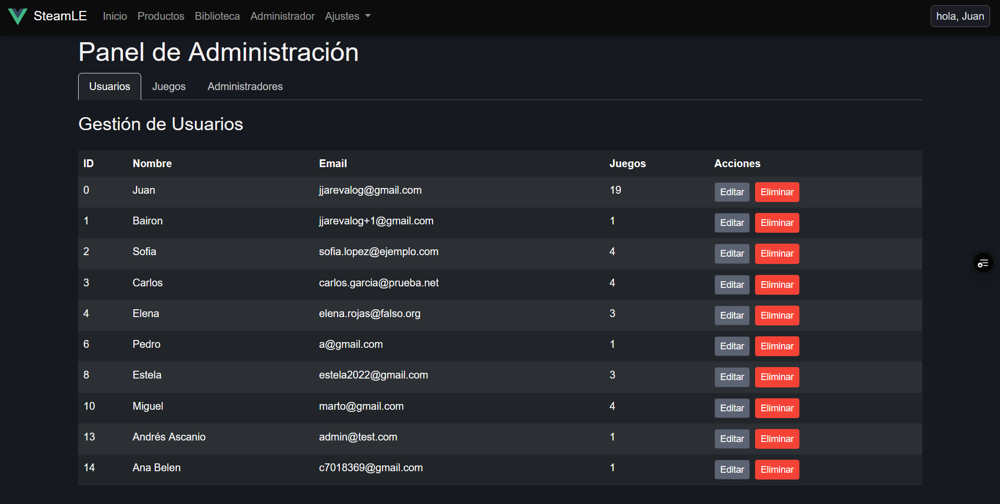

### Crear/Editar Usuario (Modal)

Se utiliza un **modal de Bootstrap** para:
- Editar nombre, email y contraseña
- Gestionar la biblioteca de juegos del usuario
- Añadir o remover juegos de la biblioteca

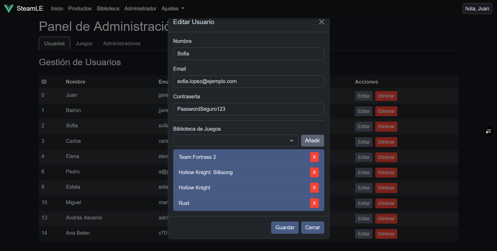

### Eliminar Usuario

- Confirmación mediante **Modal de Confirmación personalizado**
- Eliminación del registro en Google Sheets
- Actualización automática de la lista

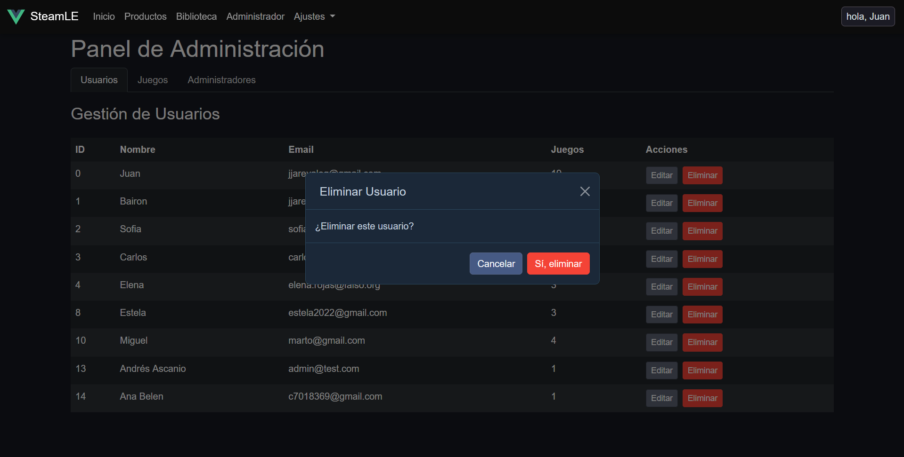

---

## CRUD de Productos/Juegos

### Listado de Productos

La tabla muestra los juegos del catálogo con información importada desde **Steam API**:
- AppID
- Nombre del juego
- Precio
- Acciones

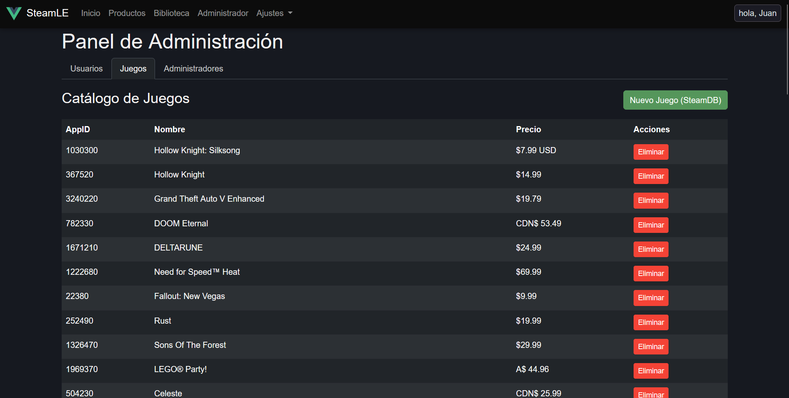

### Crear Producto (Modal)

1. Se ingresa el **AppID** del juego de Steam
2. El sistema busca el juego en la API de Steam
3. Se muestra una **previsualización** con imagen, nombre y descripción
4. Al confirmar, se guarda el AppID en Google Sheets

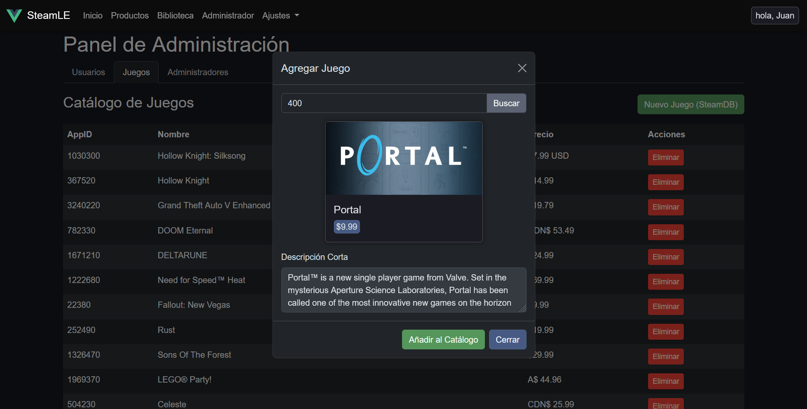

### Eliminar Producto

- Confirmación antes de eliminar
- Eliminación del AppID de la base de datos
- Actualización automática de la lista

---

## Gestión de Administradores

### Listado de Administradores

Muestra los usuarios con privilegios de administrador.

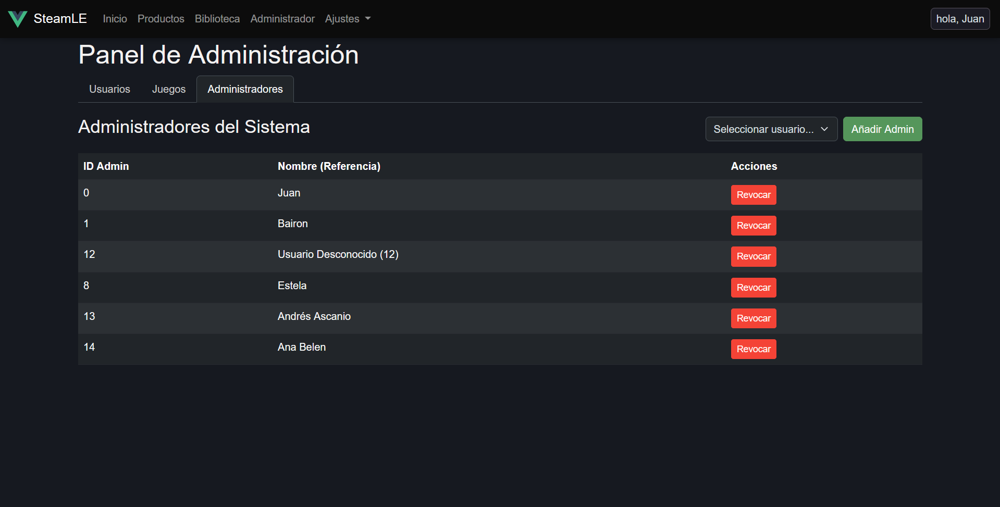

### Añadir Administrador

1. Seleccionar usuario del dropdown
2. Validar que no sea administrador previamente
3. Guardar en Google Sheets

### Revocar Privilegios

- Confirmación antes de revocar
- Eliminación del registro de administrador

---

## Modales y Sistema de Notificaciones

### Sistema de Notificaciones Toast

La aplicación implementa un **sistema de notificaciones Toast** personalizado que reemplaza las alertas nativas del navegador. Los toasts aparecen en la esquina superior derecha y se cierran automáticamente.

**Componente:** `src/components/notifications/ToastNotification.vue`

**Tipos de Toasts disponibles:**
| Tipo | Color | Uso |
|------|-------|-----|
| `success` | Verde | Operaciones exitosas |
| `error` | Rojo | Errores y fallos |
| `warning` | Amarillo | Advertencias |
| `info` | Blanco | Información general |

**Uso en componentes:**
```javascript
// Inyectar el servicio
inject: ['showToast'],

// Usar en métodos
this.showToast('success', 'Éxito', 'Operación completada');
this.showToast('error', 'Error', 'Ha ocurrido un error');
```

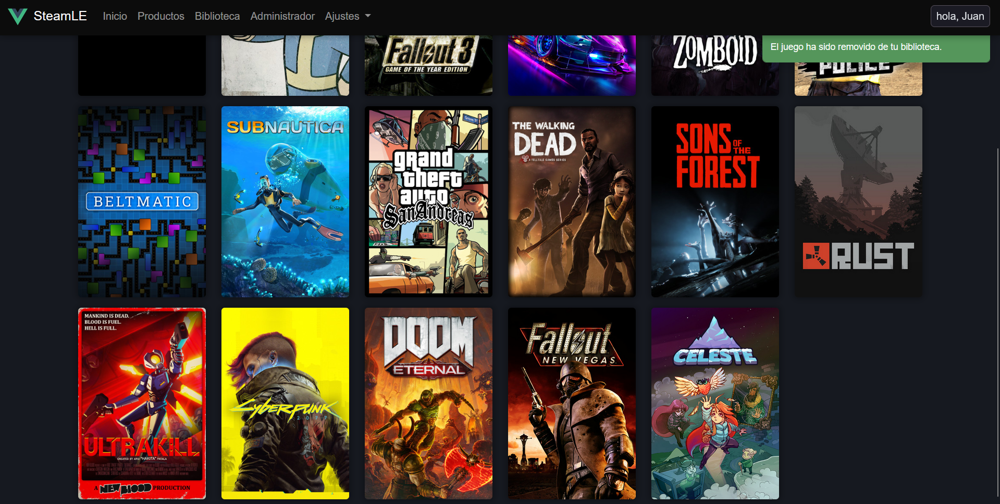

---

### Modal de Confirmación

Para acciones destructivas (eliminar, revocar), se implementó un **modal de confirmación personalizado** que reemplaza el `confirm()` nativo del navegador.

**Componente:** `src/components/modals/ConfirmModal.vue`

**Características:**
- Diseño consistente con el tema Steam (colores oscuros)
- Botones personalizables
- Retorna una Promise (permite usar `await`)
- Íconos según el tipo de acción

**Uso en componentes:**
```javascript
// Inyectar el servicio
inject: ['showConfirm'],

// Usar en métodos (debe ser async)
async deleteItem() {
    const confirmed = await this.showConfirm({
        title: 'Eliminar',
        message: '¿Estás seguro?',
        type: 'danger',
        confirmText: 'Sí, eliminar',
        cancelText: 'Cancelar'
    });
    
    if (confirmed) {
        // Proceder con la eliminación
    }
}
```

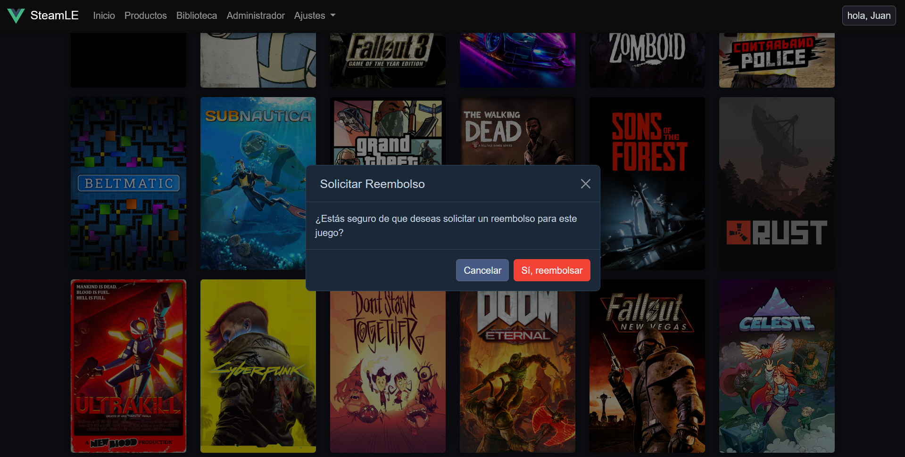

---

### Modales de Bootstrap Implementados

| Modal | Propósito |
|-------|-----------|
| `defaultModal.vue` | Modal base reutilizable con slots |
| `alertModal.vue` | Modal de alertas heredadas |
| `ConfirmModal.vue` | Confirmaciones de acciones destructivas |
| Modal de Usuario | Crear/Editar usuarios |
| Modal de Producto | Añadir juegos al catálogo |
| Modal de Juego | Detalles del juego en biblioteca |

---

## Biblioteca Personal

### Visualización

La biblioteca muestra los juegos del usuario con tarjetas visuales importadas desde Steam.

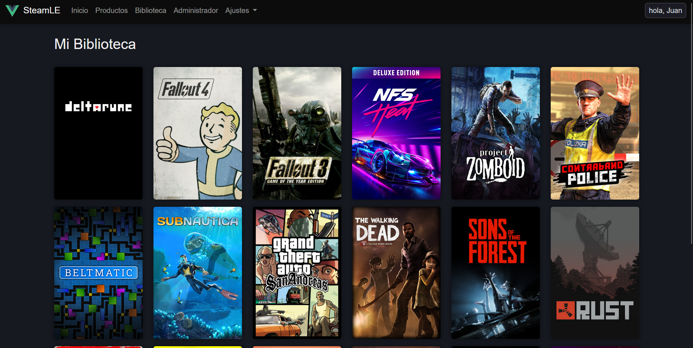

### Modal de Detalles del Juego

Al hacer clic en un juego de la biblioteca:
- **Hero Image** como fondo
- **Logo del juego** superpuesto
- **Descripción corta** del juego
- **Botón de Reembolso**

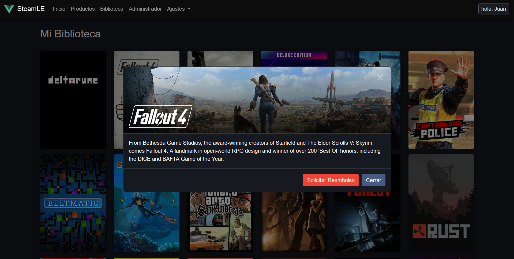

### Sincronización

La biblioteca implementa **sincronización bidireccional**:
1. Carga inicial desde localStorage (rápida)
2. Sincronización con Google Sheets en segundo plano
3. Actualización de localStorage si hay diferencias

---

## Flujo de Compra

1. El usuario navega a la vista de detalles del juego
2. Hace clic en "Comprar"
3. El AppID se añade a su biblioteca
4. Se actualiza localStorage y Google Sheets
5. El juego aparece en su biblioteca personal

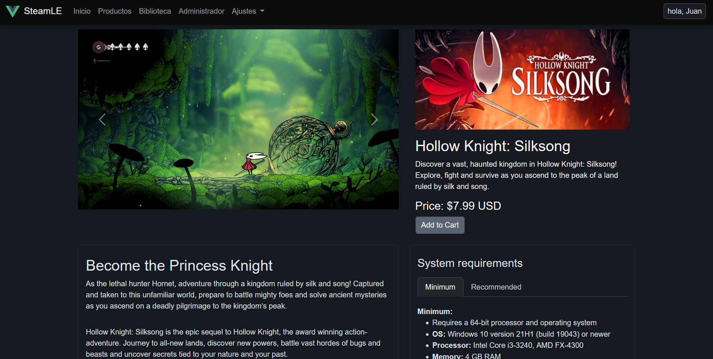

---

## Uso de Bootstrap 5

### Componentes Utilizados

- **Grid System**: Layout responsivo en todas las vistas
- **Cards**: Tarjetas de productos y biblioteca
- **Modals**: Interacción CRUD
- **Forms**: Formularios estilizados
- **Buttons**: Botones con variantes de color
- **Tables**: Tablas del panel de administración
- **Navbar**: Navegación responsive
- **Tabs**: Sistema de pestañas en admin

### Bootstrap Icons

Se utilizan íconos en toda la aplicación:
- Editar (lápiz)
- Eliminar (bote de basura)
- Crear nuevo (+)
- Buscar
- Reembolsar

---

## Tecnologías Utilizadas

| Tecnología | Versión | Uso |
|------------|---------|-----|
| Vue.js | 3.x | Framework principal |
| Vue Router | 4.x | Navegación SPA |
| Pinia | 2.x | Estado global |
| Bootstrap | 5.x | Framework CSS |
| Bootstrap Icons | - | Iconografía |
| Axios/Fetch | - | Consumo de APIs |
| Google Sheets API | - | Backend (sustituto MockAPI) |
| Steam API | - | Datos de juegos |
| Git/GitHub | - | Control de versiones |

---

## URL del Repositorio

**GitHub:** [Enlace al repositorio público]

---

## Evidencias (Pantallazos)

### Autenticación


### Panel de Administración - Usuarios


### Panel de Administración - Productos


### Panel de Administración - Administradores


### Catálogo de Productos
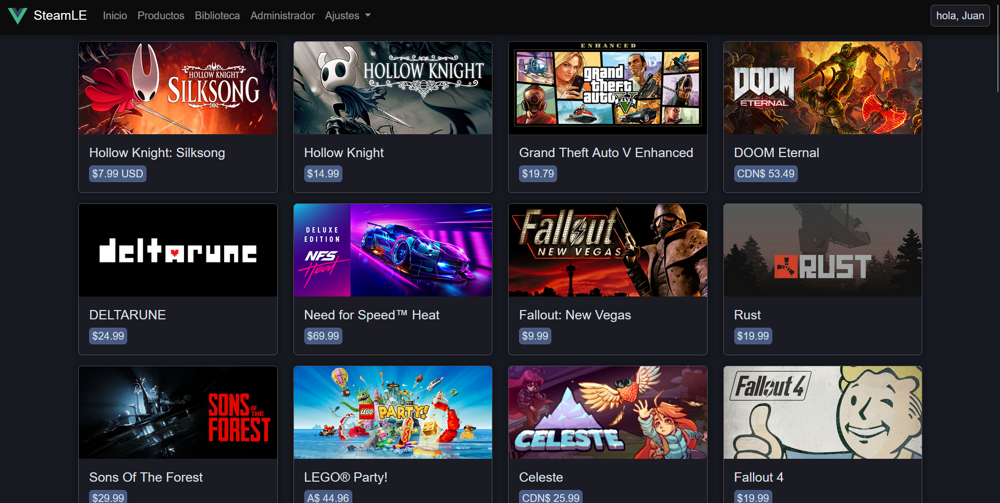

### Detalles del Juego


### Biblioteca Personal


### Alertas y Modales


---

## Paleta de colores

Este es la paleta de colores usados por Steam en su sitio oficial.
Son usados por esta aplicación para crear una interfaz más familiar.

| Nombre           | Codigo HEX | Muestra de color                                       |
|------------------|------------|--------------------------------------------------------|
| Steam Blue       | #1b2838    |  |
| Steam Light Blue | #2a475e    |  |
| Steam Highlight  | #66c0f4    |  |
| Steam Text       | #c7d5e0    |  |
| Steam Green      | #5c7e10    |  |
| Steam Dark       | #171a21    |  |

---

## Notas Adicionales

### Diferencias con la implementación tradicional de MockAPI

1. **Autenticación**: En lugar de un endpoint simple de MockAPI, se consultan todos los usuarios y se valida localmente
2. **Índices**: Google Sheets usa índices de fila para UPDATE y DELETE, por lo que se busca el índice del usuario al cargar vistas
3. **Sincronización**: Se implementó sincronización entre localStorage y Google Sheets para mantener consistencia

### Características Adicionales

- **Importación desde Steam**: Los datos de juegos se obtienen en tiempo real desde la API pública de Steam
- **Biblioteca Visual**: Las tarjetas de biblioteca usan assets especiales de Steam (hero, logo)
- **Sistema de Reembolsos**: Los usuarios pueden reembolsar juegos desde su biblioteca
- **Loading States**: Pantallas de carga durante operaciones asíncronas

---

*Documento generado como parte del Examen Final de Desarrollo de Aplicaciones Web*
